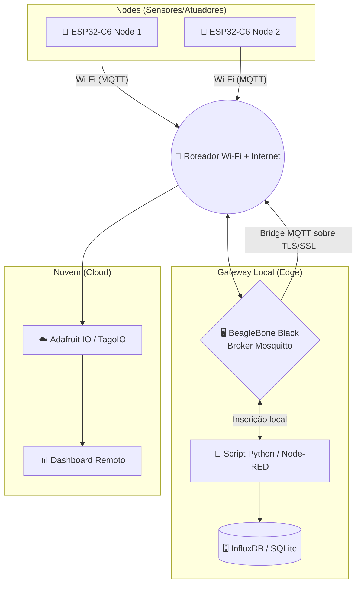

# 🌐 Projeto 3: Controle de Iluminação (Monitoramento em Nuvem e Persistência de Dados) 💡

> **Objetivo:** Evoluir a arquitetura do projeto anterior expandindo o sistema de automação para além da rede local. Nesta etapa, o **Gateway Local (BeagleBone Black)** atua como um integrador, persistindo o histórico de acionamentos em um banco de dados temporal e encaminhando os dados para uma plataforma de nuvem para monitoramento remoto em tempo real.

---

## 🏗️ Arquitetura do Sistema

O sistema estende a rede local fechada em direção à Nuvem (Cloud), permitindo o armazenamento cronológico de dados e a disponibilização de um Dashboard acessível de qualquer lugar.

---

## 🛠️ Requisitos Técnicos

### 🔧 Hardware

* [x] **02x** Módulos ESP32-C6 (ou similar com Wi-Fi).
* [x] **01x** BeagleBone Black (BBB) + Cabo Ethernet.
* [x] **01x** Roteador Wi-Fi com **acesso à internet**.
* [x] Componentes eletrônicos: Botões, LEDs, Resistores e Protoboards.

### 💻 Software e Protocolos

* **Framework:** ESP-IDF (v5.x)
* **Protocolos de Rede/Aplicação:** Wi-Fi (Modo Station), MQTT (via `espressif/mqtt`) com flag `Retain` ativa.
* **SO Gateway:** Debian/Ubuntu para BeagleBone
* **Broker MQTT Local:** Eclipse Mosquitto
* **Banco de Dados:** InfluxDB (Série Temporal) ou SQLite/PostgreSQL (Relacional).
* **Integração/Ingestão:** Node-RED ou script customizado em Python.
* **Plataforma Nuvem:** Adafruit IO, TagoIO ou servidor próprio com Grafana.

---

## 🚀 Especificações da Implementação

### Parte A: Persistência de Dados (Banco de Dados Local)

No Gateway (BeagleBone Black), foi configurada uma rotina de ingestão para registrar o histórico de eventos:

1. **Script de Ingestão:** Um script em Python (utilizando `paho-mqtt`) ou um fluxo no Node-RED intercepta as mensagens do tópico local (ex: `ifpb/projeto/led`).
2. **Armazenamento:** Cada alteração de estado gera uma nova entrada contendo o valor binário (0 ou 1 / LIGADO ou DESLIGADO) e o respectivo *Timestamp* (carimbo de tempo exato da ocorrência).

#### 📋 Visualização dos Dados Persistidos

Abaixo, observa-se a tabela de logs gerada com a persistência das transições de estado do atuador, capturando milissegundos de alteração:

### Parte B: Dashboard e Visualização na Nuvem

As mensagens locais coletadas pelo broker Mosquitto da BBB são replicadas para a Nuvem através de uma **Bridge MQTT segura (sobre TLS/SSL)**.

1. **Plataforma:** Utilizou-se uma plataforma IoT para a recepção das variáveis de telemetria.
2. **Componentes do Dashboard:**
* **Status Indicator:** Um widget visual que exibe em tempo real o estado atual do LED (Vermelho para Desligado/Inativo ou Verde/Aceso para Ativo).
* **Gráfico Histórico (Monitor Gráfico):** Gráfico temporal em formato de onda quadrada que mapeia o comportamento do LED ao longo do tempo.

#### 📊 Painel de Monitoramento (Dashboard)

O gráfico abaixo ilustra as alternâncias rápidas de ligamento/desligamento do dispositivo mapeadas diretamente no painel de controle:

### Parte C: Otimização dos Nodes (ESP32)

Para evitar perda de sincronismo entre o painel virtual e o estado físico real, as seguintes boas práticas foram implementadas no firmware do ESP32-C6:

* **MQTT Retain Flag:** As publicações de alteração de estado do LED são enviadas com o sinalizador `retain = true`. Isso garante que, se o dashboard ou o script de persistência forem reiniciados, eles receberão imediatamente o último estado válido conhecido do LED, mesmo sem uma nova publicação ativa.

---

## 👥 Participantes

| Nome | GitHub |
| --- | --- |
| **Rodrigues Matheus** | [@Rodriguesmath](https://github.com/Rodriguesmath) |
| **Daniel Neto** | [@Daniellineto](https://github.com/Daniellineto) |
| **Isabelle Lavinia** | [@khaos77](https://github.com/khaos77) |
| **Daniel Barbosa** | [@Dcorder123](https://github.com/Dcorder123) |
