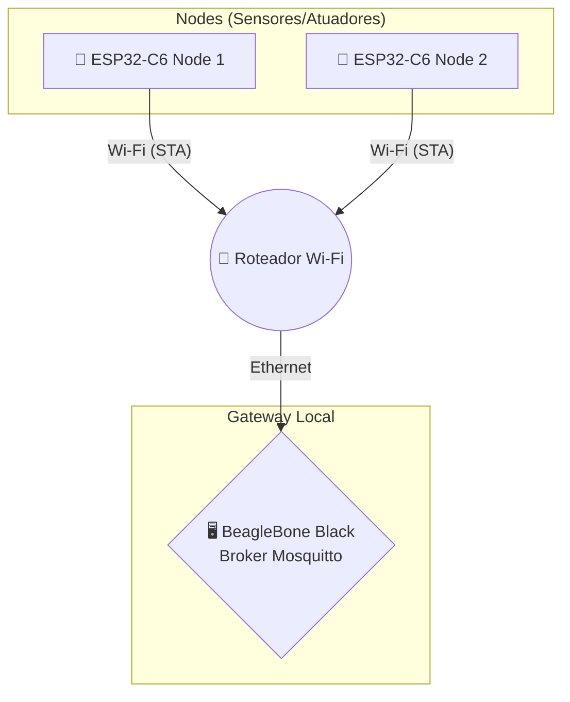

# 🌐 Projeto 2: Controle de Iluminação via Gateway IoT 💡


> **Objetivo:** Evoluir a arquitetura de um sistema de automação residencial, introduzindo um **Gateway Local dedicado (BeagleBone Black)** para centralizar a comunicação de uma rede de sensores e atuadores via protocolo MQTT.

---

## 🏗️ Arquitetura do Sistema

O sistema opera em uma rede local fechada, onde o roteador atua como ponto de acesso, conectando os dispositivos finais (via Wi-Fi) ao Gateway (via cabo Ethernet).



---

## 🛠️ Requisitos Técnicos

### 🔧 Hardware
- [x] **02x** Módulos ESP32-C6 (ou similar com Wi-Fi).
- [x] **01x** BeagleBone Black (BBB) + Cabo Ethernet.
- [x] **01x** Cartão SD (Para o SO da BBB).
- [x] **01x** Roteador Wi-Fi.
- [x] Componentes eletrônicos: Botões, LEDs, Resistores e Protoboards.

### 💻 Software
- **Framework:** ESP-IDF (v5.x)
- **Protocolos:** Wi-Fi (Modo Station) e MQTT (via `espressif/mqtt`)
- **Sistema Operacional:** Debian/Ubuntu for BeagleBone
- **Broker MQTT:** Eclipse Mosquitto

---

## 🚀 Passo a Passo de Implementação

### Parte A: Configuração do Gateway (BBB)

1. **Instalação do Broker e Ferramentas**
   Acesse a BBB via SSH e execute:
   ```bash
   sudo apt update
   sudo apt install mosquitto mosquitto-clients -y
   sudo systemctl enable mosquitto
   ```

2. **Permissão de Conexões Externas**
   Como o Mosquitto 2.0+ vem bloqueado por padrão, crie um arquivo de configuração:
   ```bash
   sudo nano /etc/mosquitto/conf.d/external.conf
   ```
   Adicione as seguintes linhas, salve (`Ctrl+O`, `Enter`) e saia (`Ctrl+X`):
   ```text
   listener 1883 0.0.0.0
   allow_anonymous true
   ```

3. **Aplicação e Teste**
   Reinicie o serviço e verifique se a porta `1883` está aberta:
   ```bash
   sudo systemctl restart mosquitto
   netstat -tln | grep 1883
   ```
   
> 💡 **Dica de Ouro:** Descubra o IP da sua BBB digitando `hostname -I`. Recomenda-se fixar este IP no DHCP do roteador para que os Nodes não percam a conexão com o Gateway!

### Parte B: Atualização dos Nodes (ESP32)

No seu projeto C (ESP-IDF), realize as seguintes alterações:
1. **SSID e Senha:** Configure as credenciais do roteador físico.
2. **URI do Broker:** Altere a constante `MQTT_BROKER_URI` (ou equivalente) para o IP real da sua BeagleBone Black (ex: `mqtt://192.168.0.100`).

---

## 🏆 Desafio Extra: Monitoramento de Tráfego

Para visualizar tudo o que acontece na rede diretamente pelo terminal da BBB, use as ferramentas de cliente instaladas e salve um arquivo de log simples com o histórico de acionamentos:

```bash
# Monitora todas as mensagens do tópico de teste e salva em .txt
mosquitto_sub -t "seu/topico/#" -v > log_acionamentos.txt
```

---

## 👥 Participantes

| Nome | GitHub |
| :--- | :--- |
| **Rodrigues Matheus** | [@Rodriguesmath](https://github.com/Rodriguesmath) |
| **Daniel Neto** | [@Daniellineto](https://github.com/Daniellineto) |
| **Isabelle Lavinia** | [@khaos77](https://github.com/khaos77) |
| **Daniel Barbosa** | [@Dcorder123](https://github.com/Dcorder123) |
